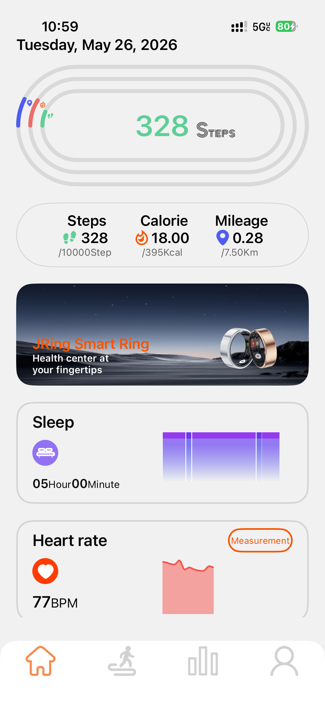
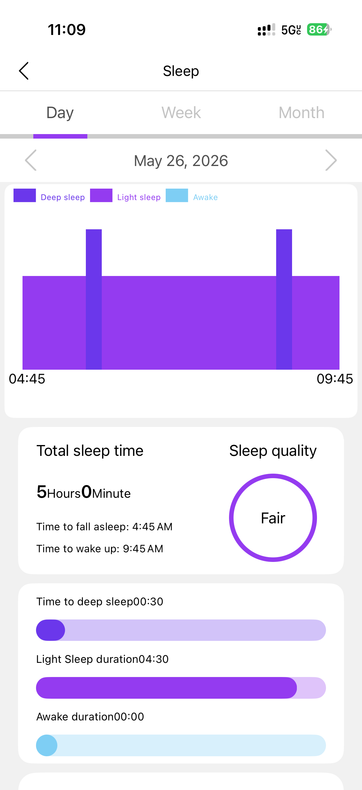

# SMART_RING BLE Notes

Reverse-engineering notes and a small Python CLI for a cheap AliExpress-style BLE smart ring advertised as `SMART_RING`.

The raw Wireshark captures and local CLI logs are intentionally ignored by Git because BLE captures can include device identifiers from phones, computers, and nearby devices. The protocol notes keep the ring address because it is useful for following the analysis, but unrelated central/client identifiers have been redacted.

## Screenshots

These screenshots from the JRING app were used to match BLE packets against visible app values such as steps, calories, mileage, sleep duration, and heart rate.

| Home / summary | Sleep detail |
| --- | --- |
|  |  |

## What Works

- Scan/connect with Python and Bleak.
- Read battery via standard BLE Battery Service.
- Sync ring time.
- Query status.
- Query current activity: steps, distance-like units, calories.
- Start HR and decode BPM.
- Start SpO2 and decode final percentage.
- Trigger find-ring light.
- Enable selfie mode and receive clench/shutter events.
- Pull early history/measurement streams for further decoding.

## Hardware

- Cheap AliExpress smart ring, advertised as `SMART_RING`
  - Seller listing: `https://www.aliexpress.us/item/3256810466598469.html`
  - Listed main chip: Coolchip / AB2026
  - Listed memory: `64KB + 8K cache + 8Mbit flash`
  - Listed Bluetooth: `5.4`
  - Listed material: `304 stainless steel`
- Nordic nRF52840 BLE dongle for Wireshark/nRF Sniffer captures
- MacBook BLE for direct Python/Bleak control
- iPhone running the original JRING app for comparison

## Files

- [Protocol.md](Protocol.md): implementer-facing protocol reference. Start here if you want the GATT layout, packet shape, command bytes, expected notifications, decoded fields, and uncertainty markers.
- [ring-protocol-notes.md](ring-protocol-notes.md): longer working notes with capture evidence, packet examples, and how each command was inferred.
- [lab-notes.md](lab-notes.md): brief chronological lab notebook covering each Wireshark capture and CLI run.
- [smart_ring_cli.py](smart_ring_cli.py): interactive Python/Bleak CLI used to scan, connect, send commands, subscribe to notifications, and produce verbose logs.
- [requirements.txt](requirements.txt): Python dependency list.
- [screenshots/](screenshots): app screenshots used as ground truth while decoding visible values.

## Run

```bash
python3 -m pip install -r requirements.txt
python3 smart_ring_cli.py
```

Useful CLI commands:

```text
scan
connect
notify on
battery
time sync
activity
hr run 45
spo2 run 45
find
selfie on
history
```
